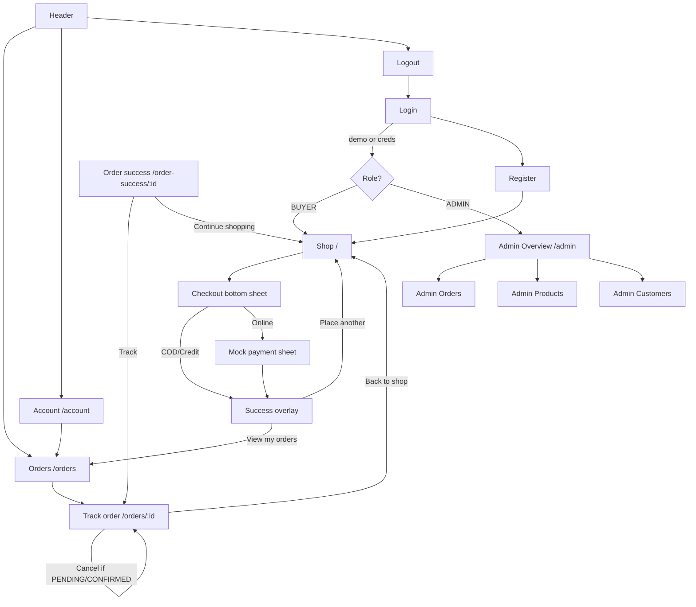

# FreshKart — B2B Mandi · End-to-End Figma Design Brief

> **Hand this file to Claude / a design AI to build the entire product in Figma.**
> It is self-contained: it covers the brand, the design system (tokens + components),
> every business cycle, every screen with its sections/states, the real content/data,
> and a recommended Figma file structure. Build it **mobile-first** as a single
> e-commerce app.

---

## 0. How to use this brief

1. Build the **Foundations** (Section 3) first — color/type/spacing styles + variables.
2. Build the **Component Library** (Section 4) as reusable components with variants.
3. Lay out **Screens** (Section 7) on a 480 px mobile frame, composing components.
4. Wire **Prototype flows** following the **Business Cycles** (Section 5) + **Flow map** (Section 6).
5. Apply the **States matrix** (Section 8) so every screen has empty / loading / error / success.
6. Use the real **Content & Data** (Section 9) — do not invent placeholder copy or prices.

**Platform:** Responsive web app rendered as a **centered mobile column** (max width **480 px**) with a soft drop shadow on desktop. Everything is designed for a phone first; the desktop simply centers the same 480 px column on a light-gray backdrop.

---

## 1. Product overview

**FreshKart** (internal: *B2B Mandi*) is a **Ninjacart-style B2B wholesale fresh-produce marketplace**. It connects **buyers** (kirana stores, retailers, hotels/restaurants/caterers — HoReCa) with fresh fruit & vegetable supply, priced **per kg / per piece** and ordered **in bulk** with minimum-order quantities.

- **Tagline:** "Wholesale B2B · per kg"
- **Core promise:** Live B2B rates · order in bulk · pay COD, credit or online · 1–2 day delivery.
- **Tone:** Fresh, trustworthy, fast, utilitarian. Think a clean grocery-commerce app (Blinkit/Zepto/Ninjacart energy) but for **wholesale business buyers**, not consumers.

### Roles
| Role | Who | What they do |
|------|-----|--------------|
| **BUYER** | Kirana store owner, retailer, hotel/restaurant | Browse catalog, build a bulk cart, checkout, pay, track & reorder |
| **ADMIN** | FreshKart operations | Dashboard, manage all orders & their status, manage inventory (price/stock/active), view customers |
| **SELLER** | Farmer/wholesaler (data model only) | Listed as the source of each product; **no dedicated UI to design** (legacy — admin manages everything) |

> Design effort = **Buyer app** + **Admin console**. Seller has no screens.

---

## 2. Art direction

- **Fresh & green-forward** — the brand green signals produce & freshness; orange accent for highlights/secondary CTAs.
- **Card-based, rounded, airy** — white cards on a light-gray canvas, generous 12–16 px radii, soft shadows.
- **Dense but legible** — wholesale buyers scan fast; show price, unit, min-order, stock at a glance.
- **Mobile-thumb-friendly** — sticky header, sticky cart bar, bottom-sheet checkout, big tap targets, quantity steppers.
- **Status-driven** — color-coded order statuses everywhere (pending→delivered).
- **Trust signals** — "Quality checked", "easy returns on bad stock", "Simulated gateway · PCI-safe demo", GSTIN fields.

---

## 3. Foundations (design tokens)

### 3.1 Color — Brand (primary green)
| Token | Hex | Use |
|-------|-----|-----|
| brand-50 | `#effdf4` | tint backgrounds, success chips |
| brand-100 | `#d8fbe5` | badges, soft fills |
| brand-200 | `#b3f5cd` | borders on tinted cards |
| brand-300 | `#79eaa8` | focus rings (light) |
| brand-400 | `#3dd67d` | hover/active accents |
| **brand-500** | **`#16bd5f`** | **PRIMARY** — header bg, primary buttons, active chips, icons |
| brand-600 | `#0a9a4b` | primary button hover, CTAs |
| brand-700 | `#0a793e` | pressed, dark text on tint |
| brand-800 | `#0d5f34` | text on light-green chips |
| brand-900 | `#0c4e2d` | deepest |

### 3.2 Color — Accent (orange)
| Token | Hex | Use |
|-------|-----|-----|
| accent-50 | `#fff8ed` | — |
| accent-100 | `#ffefd4` | — |
| accent-500 | `#ff8014` | secondary buttons, "Revenue" stat icon |
| accent-600 | `#f0640a` | secondary hover |
(Full ramp exists 50–900 mirroring brand; 500/600 are the ones used.)

### 3.3 Color — Neutral gray (Tailwind gray)
| Token | Hex | Use |
|-------|-----|-----|
| gray-50 | `#f9fafb` | app canvas, input fill |
| gray-100 | `#f3f4f6` | desktop backdrop, dividers, chips |
| gray-200 | `#e5e7eb` | borders |
| gray-300 | `#d1d5db` | input borders, faint icons |
| gray-400 | `#9ca3af` | placeholder, meta text, muted icons |
| gray-500 | `#6b7280` | secondary text |
| gray-600 | `#4b5563` | body secondary |
| gray-700 | `#374151` | body text |
| gray-800 | `#1f2937` | strong body |
| gray-900 | `#111827` | headings, primary text |

### 3.4 Color — Semantic / status
| Status | Bg | Text | Hex (bg / text) |
|--------|----|------|-----------------|
| PENDING | amber-100 | amber-800 | `#fef3c7` / `#92400e` |
| CONFIRMED | blue-100 | blue-800 | `#dbeafe` / `#1e40af` |
| PACKED | indigo-100 | indigo-800 | `#e0e7ff` / `#3730a3` |
| SHIPPED | purple-100 | purple-800 | `#f3e8ff` / `#6b21a8` |
| DELIVERED | brand-100 | brand-800 | `#d8fbe5` / `#0d5f34` |
| CANCELLED | red-100 | red-700 | `#fee2e2` / `#b91c1c` |
| Error | red-50 / red-200 border | red-600/700 | `#fef2f2` / `#dc2626` |
| Test-mode chip | amber-100 | amber-700 | `#fef3c7` / `#b45309` |

### 3.5 Typography
- **Family:** **Inter** (fallback system-ui, sans-serif). Antialiased.
- **Scale (px / weight) — exactly what the app uses:**

| Style | Size | Weight | Example use |
|-------|------|--------|-------------|
| Display/H1 | 24 (text-2xl) | 700 bold | "Welcome back 👋" |
| H1 page | 20 (text-xl) | 700 bold | "Your account", "Order placed!" |
| H2 / section | 18 (text-lg) | 700 bold | "Your orders" |
| Base/body | 16 (text-base) | 400–700 | buttons (lg), primary labels |
| Body | 14 (text-sm) | 400–700 | most UI text, list items |
| Caption | 12 (text-xs) | 400–600 | meta, hints, badges |
| Micro | 11 (`text-[11px]`) | 400–700 | min-order chip, fine print |
| Nano | 10 (`text-[10px]`) | 600 | "TEST MODE", header subtitle, "+min / tap" |
| Price (emphasis) | 18 | 800 extrabold | product price `₹24` |

- **Number formatting:** Indian Rupee, no decimals → `formatCurrency` = `₹24`, `₹1,250`. Locale `en-IN`.
- **Date formatting:** `15 Jun 2026` (day, short month, year, `en-IN`).

### 3.6 Spacing, radius, shadow
- **Spacing scale:** 4 px base (gap-1=4, gap-2=8, gap-3=12, p-3=12, p-4=16, p-5=20, py-3.5=14, etc.).
- **Radius:** `rounded-md` 6 · `rounded-lg` 8 · `rounded-xl` 12 · `rounded-2xl` 16 · `rounded-full` pill/circle · `rounded-t-2xl` 16 (bottom sheets top corners).
- **Shadow:**
  - `shadow-card` = `0 1px 3px rgba(0,0,0,.06), 0 1px 2px -1px rgba(0,0,0,.04)` (cards)
  - `shadow-card-hover` = `0 8px 24px -6px rgba(0,0,0,.12)`
  - `shadow-sm` (subtle card), `shadow-lg` (sticky cart bar), `shadow-xl` (the phone-frame column on desktop).
- **Focus ring:** 2 px ring in brand-100/200/300 (or gray-200 for neutral controls).

### 3.7 Frame & layout
- **Mobile frame:** width **480 px** (design at 390–414 too if you want; 480 is the max column). Min-height = screen. Background `gray-50`. On desktop the column is centered (`mx-auto`) over a `gray-100` page with `shadow-xl`.
- **App header height:** ~56 px (`py-3` + content), sticky, `z-30`.
- **Bottom sticky cart bar:** floats above content, `z-30`, 12 px inset padding.
- **Bottom sheets / overlays:** full-screen scrim `bg-black/40–50`, content slides up with `rounded-t-2xl`, `max-h-[88vh]`, scrollable.

### 3.8 Icon set
**lucide-react** line icons, ~16–20 px (`h-4 w-4` to `h-5 w-5`), `h-3.5/3` for meta. Icons used across the app:
`Sprout` (logo), `LayoutDashboard`, `LogOut`, `LogIn`, `Package`, `User`, `Search`, `Plus`, `Minus`, `Trash2`, `ShoppingCart`, `Loader2` (spinner), `MapPin`, `X`, `CheckCircle2`, `ShieldCheck`, `Truck`, `Wallet`, `Phone`, `ClipboardCheck`, `ClipboardList`, `PackageCheck`, `XCircle`, `IndianRupee`, `Users`, `AlertTriangle`, `AlertCircle`, `CreditCard`, `Smartphone`, `Lock`, `Zap`, `ChevronRight`.

---

## 4. Component library (build as Figma components with variants)

### Atoms
1. **Button** — variants: `primary` (brand-500 bg, white, hover brand-600), `secondary` (accent-500), `outline` (white, gray-300 border, gray-800), `ghost` (transparent, gray-700, hover gray-100), `danger` (red-600). Sizes: `sm` h-32, `md` h-40, `lg` h-48. Radius 8. Optional leading icon + spinner (Loader2) when loading. Disabled = 50% opacity.
2. **Input / Field** — two flavors:
   - `input-base`: white bg, gray-300 border, radius 8, focus brand-500 border + brand-200 ring.
   - `field`: gray-50 bg, gray-200 border, focus white bg + brand-100 ring (used in checkout & payment).
   - **Field wrapper:** label (14, medium, gray-700) above input, optional red-600 12 px error below.
   - Also: **Textarea** (min-h 96, resize-y), **Select** (with chevron padding), read-only/disabled (gray-100 bg).
3. **Badge** — pill, `px-2.5 py-0.5 text-xs font-medium`. Default + **OrderStatusBadge** (uses the status colors in 3.4).
4. **Chip** (category filter) — pill `px-3.5 py-1.5 text-xs font-semibold`; active = brand-500 bg + white; idle = white bg + gray-200 border + gray-600 text.
5. **Spinner** — Loader2 spinning, brand-500.
6. **Avatar/logo mark** — Sprout icon in a rounded square (`white/20` on header, `brand-50/brand-600` in admin).

### Molecules
7. **Card** — white, gray-200 border, radius 12, `shadow-card`. Sub-parts: `CardHeader` (border-bottom, px-5 py-4), `CardBody` (p-5).
8. **Stat card** (admin) — label (xs gray), big value (xl/2xl bold), optional hint, icon chip tinted by accent (`brand` / `accent` / `red` / `gray`). 2-up grid.
9. **Product list item** (the catalog row) — see 7.3.
10. **Cart line row** — thumbnail 48, name + unit price, qty stepper, line total.
11. **Order card** (buyer list) — order number + status badge, up to 4 item thumbnails (+N), date · item count, total + chevron.
12. **Order card (admin)** — order number + business name + status badge, city · date · items/kg, total + status control.
13. **Customer card** (admin) — name, business, phone · city, "N orders · ₹X spent".
14. **Product admin row** — thumbnail 64, name/category/price·MOQ, active/inactive badge, editable Price & Stock number inputs, Active checkbox, Save button (enabled only when dirty).
15. **Quantity stepper** — brand-500 pill: `–` (or trash icon when at min) · `qty unit` · `+` (disabled at stock cap). Increments by **minOrderQty**.
16. **Empty state** — centered icon-in-circle (brand-50), bold title, muted subtitle, optional CTA button.
17. **Full-screen loader** — centered spinner + label (e.g. "Loading your shop…"), optional scrim overlay.
18. **Alert/Inline message** — success (brand-50/brand-200, CheckCircle2) and error (red-50/red-200, AlertCircle).

### Organisms
19. **App header (buyer)** — brand-500 bar: logo + "FreshKart / Wholesale B2B · per kg" (left); right actions: optional **Admin** pill (if admin), **Orders** icon button, **Account** icon button, **Logout** icon button. Unauth state: just **Login** pill. All icon buttons are 32 px circles `white/15`.
20. **Admin header + nav** — white header with ShieldCheck mark + "Admin"; sticky sub-nav of tabs (Overview / Orders / Products / Customers), active tab = brand-500 bg white.
21. **Sticky cart bar** — brand-600 pill button: cart icon + "N items · ₹total" (left), "Review & Order →" (right).
22. **Checkout bottom sheet** — see 7.4.
23. **Mock payment sheet** — see 7.5.
24. **Order status timeline** — vertical stepper, 5 stages, brand dots + connectors for done/current, gray for pending; cancelled = single red XCircle row.
25. **Promo banner** — gradient brand-500→brand-600 card, white text.
26. **Success overlay** — full-screen white, big CheckCircle2 in brand-50 circle, order number chip, total, payment chip, CTAs.

---

## 5. Business cycles (end-to-end)

> These are the heart of the brief — design the prototype so each cycle flows as one closed loop.

### Cycle A — Authentication & session
```
Visitor ──▶ /onboarding ──(Phone OTP OR Google sign-in)──▶ Firebase Auth
   │                                                              │
   │                                                   profile exists? ──▶ role = ADMIN? ──▶ /admin
   │                                                                              └─ else ──▶ / (shop)
   └─ "Create account" ──▶ /onboarding (shop setup: name, business, email/phone, address) ──▶ creates BUYER ──▶ /

Already logged in hits / ──▶ auto-redirect to / or /admin (no loop)
Logout (header) ──▶ clears session ──▶ full reload to /onboarding
Protected page without session ──▶ /onboarding?callbackUrl=<path>
```
**Supported sign-in methods:** Firebase Phone OTP and Google sign-in. Email/password sign-in is not implemented.

### Cycle B — Buyer ordering loop (core e-commerce)
```
/ (Shop) ──▶ search / filter by category
        ──▶ tap ADD on a product (adds minOrderQty)  ──▶ stepper +/- (steps by minOrderQty, capped at stock)
        ──▶ Sticky cart bar appears ("N items · ₹total · Review & Order →")
        ──▶ Tap ──▶ Checkout bottom sheet:
                     • Items (editable qty)
                     • Delivery details (name, phone, city, address, pincode — all required)
                     • Payment method: COD | Credit | Online
                     • Bill (item total, delivery FREE, to-pay)
                     ──▶ Place order
                          ├─ COD / Credit ──▶ create order ──▶ Success overlay
                          └─ Online ──▶ Mock payment sheet (Card/UPI, TEST MODE)
                                          ──▶ pay ──▶ create order ──▶ Success overlay
        Success overlay ──▶ "Place another order" (reset → Shop)  OR  "View my orders" (/orders)
```
Then the **post-order loop**: `/order-success/[id]` (if navigated) → **Track order** (`/orders/[id]`) → **Continue shopping** (`/`) → reorder. Closed loop: **Shop → Cart → Checkout → Pay → Confirm → Orders → Track → Shop**.

### Cycle C — Order fulfillment lifecycle (status state machine)
```
PENDING ──▶ CONFIRMED ──▶ PACKED ──▶ SHIPPED ──▶ DELIVERED
   │            │
   └────────────┴──▶ CANCELLED   (buyer may cancel while PENDING or CONFIRMED; admin can cancel)
```
- **Buyer** sees this as a 5-step timeline on the tracking page; **CANCELLED** replaces the timeline with a red "Order cancelled · stock released" row.
- **Admin** advances status via the order's status control. Cancelling releases stock.

### Cycle D — Admin operations loop
```
/admin (Overview: revenue, orders, products, customers, low-stock; orders-by-status; recent orders)
   ├─▶ /admin/orders ── advance each order's status (PENDING→…→DELIVERED / CANCELLED)
   ├─▶ /admin/products ── edit price & stock, toggle Active, Save (low-stock flagged when stock ≤ 2×MOQ)
   └─▶ /admin/customers ── view buyers with order count + total spent
```

### Cycle E — Account management
```
/account ── role badge ── edit profile (name, business, phone, GSTIN, address, city, pincode; email read-only)
        ──▶ Save (inline success) ── link ▶ /orders
```

### Cycle F — Payment cycle
- **COD** — "Cash on delivery", order placed immediately, success chip amber-ish.
- **CREDIT** — "Business credit" (pay later), placed immediately.
- **ONLINE** — opens **Mock payment sheet** (Card or UPI tabs, pre-filled test card `4242 4242 4242 4242`, "TEST MODE" + "Simulated gateway · PCI-safe demo"); on success shows "✓ Paid online". (Real Razorpay is supported in code but design the **mock** sheet.)

---

## 6. Navigation / flow map



**Header (buyer, authed):** logo→`/` · Orders→`/orders` · Account→`/account` · Logout. **Admin** also gets an "Admin" pill→`/admin`.
**Admin nav tabs:** Overview · Orders · Products · Customers.

---

## 7. Screen-by-screen specs

> Frame width 480 px. Header is present on buyer screens (brand bar); admin screens use the admin header+nav.

### 7.1 Onboarding — `/onboarding`
- **Header copy:** H1 "Welcome to FreshKart" (24/bold), subtitle "Wholesale fresh produce for your business." (14/gray-500).
- **Step 1 — Mobile:** Phone number input (10-digit India mobile), reCAPTCHA verifier, **Send OTP** button.
- **Step 2 — Verify:** 6-digit OTP input with auto-focus, resend countdown, **Verify** button.
- **Alternative method:** **Continue with Google** button (brand-accurate "G" icon). Google sign-in is gated by `api.signInWithGoogle` availability.
- **Step 3 — Shop setup:** Full name, Business name, Business type, Email (if phone was used) / Phone (if Google was used), Address with map picker, City, Pincode.
- **Redirecting state:** full-screen loader overlay "Loading your shop…" / "Loading dashboard…".
- Email/password login and `/login`, `/register` routes are not implemented.

### 7.3 Shop / Home — `/` (UnifiedOrderScreen) — **primary screen**
- **Sticky sub-header (white):** search input (gray-50 field, Search icon) placeholder "Search produce…"; below it a horizontal **chip rail** — "All" + one chip per category (Vegetables, Leafy Greens). Active chip brand-500.
- **Promo banner:** gradient brand card — "Wholesale fruits & veggies 🥦" + "Live B2B rates · order in bulk · pay COD, credit or online."
- **Product list (single column, cards):** each row =
  - 96×96 image (rounded-xl, gray-100 fallback),
  - name (14/bold), origin line (MapPin + city, 11/gray-400),
  - price `₹24` (18/extrabold) + "/ kg" (12/gray-400),
  - **"Min order N kg"** chip (brand-50/brand-700, 11),
  - right column: **ADD** button (brand outline) → when added becomes the **qty stepper** (brand-500 pill, `–|qty kg|+`, trash icon at min, `+` disabled at stock) + line total below + "+N kg / tap" hint.
- **Sticky cart bar** (appears when ≥1 item): brand-600 pill "🛒 N items · ₹total" + "Review & Order →".
- **Empty search state:** centered "No items found."
- **States:** default, typing/filtering, item-in-cart (stepper), stock-capped (`+` disabled), empty results.

### 7.4 Checkout bottom sheet (overlay on Shop)
- Scrim `black/40`; sheet `rounded-t-2xl`, max-h 88vh, scrollable; sticky sheet header "Your order" + X.
- **Sections (white cards on gray-50):**
  1. **Items** — cart line rows (48 thumb, name, unit price, stepper, line total).
  2. **Delivery details** (MapPin title) — fields: Business / shop name (full), Phone, City (row), Full address (full), Pincode. All required.
  3. **Payment** — 3 radio rows: "Cash on delivery", "Business credit", "Pay online". Selected = brand-50/brand-500 border.
  4. **Bill** — Item total, Delivery **FREE** (brand-600), dashed divider, **To pay** (bold).
  - Trust line: "🛡️ Quality checked · easy returns on bad stock".
  - Error message (red) if fields missing / order fails.
  - **CTA:** "Place B2B order · ₹total" (COD/Credit) or "Pay ₹total" (Online); shows "Placing order…" spinner while busy.

### 7.5 Mock payment sheet (overlay, Online only)
- Scrim `black/50`; `rounded-t-2xl` white sheet. Header: Lock icon + "Pay securely" + amber **TEST MODE** chip + X.
- **Tabs:** Card | UPI.
  - **Card:** Card number (pre-filled `4242 4242 4242 4242`, auto-spaces), Name on card, MM/YY + CVV (row). Helper "Test card pre-filled — no real charge is made."
  - **UPI:** UPI id field (`yourname@okbank`) + GPay/PhonePe/Paytm tags.
- **CTA:** "🔒 Pay ₹amount"; footer "✓ Simulated gateway · PCI-safe demo".
- **Processing state:** centered spinner "Processing ₹amount…" + "Do not close this screen."
- Validation errors inline (invalid card/expiry/CVV/UPI).

### 7.6 Order-placed success overlay (in-app, after placing)
- Full-screen white, centered: big CheckCircle2 in brand-50 circle, "Order placed!", "Your B2B order is confirmed.", order-number chip, "Total ₹X", payment chip ("✓ Paid online" / "Business credit" / "Cash on delivery").
- **CTAs:** "Place another order" (primary) + "📦 View my orders" (outline).

### 7.7 Order success page — `/order-success/[id]`
- Success hero (CheckCircle2, "Order placed!", "Thanks — your order is confirmed and being prepared.", order-number chip).
- **ETA strip** (brand-500 card): Truck + "Arriving in 1–2 days" + "We'll notify you when it's out for delivery."
- **Order summary** card (Package title): line items (name × qty unit → line total), dashed divider, **Total paid**, payment line.
- **Delivering to** card (MapPin): name, address, city — pincode, phone.
- **CTAs:** "Track order" (brand-600) + "Continue shopping" (outline).

### 7.8 Orders list — `/orders`
- Header row: "Your orders" (18/bold) + "← Back to shop" small outline link.
- **Order cards:** order number + status badge; up to 4 item thumbnails (+N more); date · N items; total + chevron.
- **Empty state:** Package-in-circle, "No orders yet", "When you place an order, you can track it right here.", **Browse produce** button → `/`.

### 7.9 Order tracking — `/orders/[id]`
- Optional top banner "Order placed successfully!" (brand-50) if `?placed=1`.
- Header: order number + "Placed {date}" + status badge.
- **Tracking card:** 5-stage vertical timeline (Order placed → Confirmed → Packed & ready → Out for delivery → Delivered) with per-stage note; done = brand dot, current = brand dot with glow ring, pending = gray. **Cancelled variant:** single red XCircle row "Order cancelled / stock was released."
- **Items card:** "Items (N)" with rows (thumb, name, `₹price/unit × qty`, line total) + Total.
- **Delivery address card** (MapPin): name, address line, phone.
- **Payment card** (Wallet): "Cash on delivery" / "Credit (pay later)" / "Online payment".
- **Notes card** (if any).
- **Cancel order** button (danger/outline) — only when PENDING or CONFIRMED.

### 7.10 Account — `/account`
- Header: "Your account" (20/bold) + role **Badge** (brand-100/brand-800, e.g. "BUYER").
- **Profile card:** "Profile details" + form — Email (read-only/disabled), Full name + Business name (row), Phone + GSTIN (row), Address (full), City + Pincode (row). **Save changes** button. Inline success ("Profile updated.") / error alerts.
- Below: **Your orders** outline button → `/orders`.

### 7.11 Admin overview — `/admin`
- Admin header (ShieldCheck + "Admin") + nav tabs (Overview active).
- **Stat cards (2-up):** Revenue (₹, accent, hint "Non-cancelled"), Orders (brand), Products (brand, hint "N active"), Customers (accent), Low stock (red if >0 w/ AlertTriangle, else gray w/ CheckCircle2).
- **Orders by status** card: row of status badges with counts (Pending: n, Confirmed: n, … Cancelled: n).
- **Recent orders** card: header + "View all" → `/admin/orders`; list rows (order number, business · date, total + status badge). Empty: "No orders yet."

### 7.12 Admin orders — `/admin/orders`
- List of **admin order cards**: order number + business name + status badge; city · date · "N items · X kg"; total + **status control** (advance to next status / set cancelled). Empty: ClipboardList "No orders yet."

### 7.13 Admin products — `/admin/products`
- List of **product admin rows** (thumb 64, name, category, "₹price/kg · MOQ N kg", Active/Inactive badge; editable Price/kg + Stock number inputs; Active checkbox; **Save** enabled only when changed). Empty: Package "No products yet."

### 7.14 Admin customers — `/admin/customers`
- List of **customer cards** (name, business; phone · city; "N orders · ₹X spent"). Empty: Users "No customers yet."

### 7.15 System screens
- **Loading** — full-screen brand spinner.
- **404 / not-found** — friendly empty state + "Back to shop".
- **Error** — friendly error state + retry.

---

## 8. States matrix (design every cell)

| Screen | Empty | Loading | Error | Success/Active |
|--------|-------|---------|-------|----------------|
| Login | — | redirect overlay | red alert (bad creds) | redirecting |
| Register | — | button spinner | red alert (dup email/invalid) | → shop |
| Shop | "No items found" | (server-rendered) | — | item in cart / stepper / stock-capped |
| Checkout sheet | (needs ≥1 item) | "Placing order…" | red "fill all details" / fail | → success overlay |
| Payment sheet | — | "Processing ₹X…" | inline field errors | "✓ Paid online" |
| Orders list | "No orders yet" + CTA | — | — | cards w/ status |
| Order tracking | not-found | — | — | timeline / cancelled |
| Account | — | "Saving…" | red alert | "Profile updated." |
| Admin overview | "No orders yet" | — | — | stats populated, low-stock flagged |
| Admin orders | "No orders yet" | per-row updating | per-row error | status advanced |
| Admin products | "No products yet" | "Saving…" | "Enter a valid price/stock" | saved (Save disabled when clean) |
| Admin customers | "No customers yet" | — | — | cards w/ totals |

---

## 9. Content & data (use these real values)

### 9.1 Categories
- **Vegetables** (`vegetables`)
- **Leafy Greens** (`leafy-greens`)

### 9.2 Product catalog (name · unit · ₹price · min-order · origin)
**Vegetables**
| Product | Unit | ₹ | Min | Origin |
|---|---|---|---|---|
| Onion (New Red) | kg | 24 | 25 | Kurnool, Andhra Pradesh |
| Onion (Big) | kg | 25 | 25 | Lasalgaon, Maharashtra |
| Potato | kg | 22 | 25 | Agra, Uttar Pradesh |
| Tomato | kg | 44 | 20 | Madanapalle, Andhra Pradesh |
| Green Chilli | kg | 60 | 10 | Guntur, Andhra Pradesh |
| Chilli Bajji (Bhajji) | kg | 55 | 10 | Guntur, Andhra Pradesh |
| Ginger | kg | 135 | 10 | Wayanad, Kerala |
| Garlic | kg | 180 | 10 | Madhya Pradesh |
| Cabbage | kg | 28 | 20 | Ooty, Tamil Nadu |
| Cauliflower | pc | 30 | 10 | Karnal, Haryana |
| Bottle Gourd | kg | 28 | 20 | Kolar, Karnataka |
| Ladies Finger (Okra) | kg | 38 | 10 | Anand, Gujarat |
| Donda (Tindora) | kg | 40 | 10 | Kolar, Karnataka |
| Ridge Gourd | kg | 48 | 10 | Kolar, Karnataka |
| Carrot | kg | 48 | 10 | Ooty, Tamil Nadu |
| Capsicum | kg | 55 | 10 | Pune, Maharashtra |
| Brinjal (Black) | kg | 30 | 10 | Kolar, Karnataka |
| Brinjal (Green / White) | kg | 40 | 10 | Kolar, Karnataka |
| Brinjal (Purple Long) | kg | 40 | 10 | Kolar, Karnataka |
| Dosakai (Yellow Cucumber) | kg | 35 | 10 | Andhra Pradesh |
| Keera (Cucumber) | kg | 30 | 20 | Bengaluru Rural, Karnataka |
| Beans (French) | kg | 90 | 10 | Kodaikanal, Tamil Nadu |
| Broad Beans (Chikkudu) | kg | 90 | 10 | Chittoor, Andhra Pradesh |
| Cluster Beans (Gokar) | kg | 48 | 10 | Kolar, Karnataka |
| Bitter Gourd | kg | 45 | 10 | Kolar, Karnataka |
| Raw Banana | pc | 9 | 12 | Theni, Tamil Nadu |
| Raw Mango | kg | 50 | 10 | Krishnagiri, Tamil Nadu |
| Lemon | kg | 150 | 10 | Vijayawada, Andhra Pradesh |
| Beetroot | pc | 35 | 10 | Ooty, Tamil Nadu |
| Drumstick | kg | 60 | 10 | Theni, Tamil Nadu |
| Radish | kg | 50 | 10 | Pune, Maharashtra |

**Leafy Greens**
| Product | Unit | ₹ | Min | Origin |
|---|---|---|---|---|
| Curry Leaves | kg | 60 | 5 | Tamil Nadu |
| Kothimeer (Coriander) | kg | 90 | 5 | Pune, Maharashtra |
| Pudina (Mint) | kg | 50 | 5 | Pune, Maharashtra |
| Palak (Spinach) | kg | 60 | 5 | Pune, Maharashtra |
| Gongura | kg | 50 | 5 | Telangana |
| Thotakura (Amaranth) | kg | 50 | 5 | Andhra Pradesh |
| Methi (Fenugreek) | kg | 80 | 5 | Nashik, Maharashtra |
| Spring Onion | kg | 60 | 5 | Pune, Maharashtra |

> For Figma, you don't need all 39 — design **6–10 representative cards** (mix of kg & pc, cheap & premium, short & long names) and treat the rest as repeats.

### 9.3 Order statuses (labels + colors) — see 3.4
`PENDING (Pending)` · `CONFIRMED (Confirmed)` · `PACKED (Packed)` · `SHIPPED (Shipped)` · `DELIVERED (Delivered)` · `CANCELLED (Cancelled)`.
**Tracking stage labels & notes:** Order placed ("We've received your order.") → Confirmed ("Seller accepted your order.") → Packed & ready ("Your produce is packed fresh.") → Out for delivery ("On the way to you.") → Delivered ("Order delivered. Enjoy!").

### 9.4 Payment methods
COD = "Cash on delivery" · CREDIT = "Business credit" / "Credit (pay later)" · ONLINE = "Pay online" / "Online payment".

### 9.5 Order number format
`ORD-YYYYMMDD-XXXXXX` (e.g. `ORD-20260622-AB12CD`).

### 9.6 Demo accounts
- Customer (BUYER): `customer@freshkart.in` — *Suresh Kirana Store*, Bengaluru.
- Admin: `admin@freshkart.in` — *FreshKart*, Bengaluru.
- **No password-based demo sign-in.** Use a Firebase test phone number or a Google account with the admin allowlist for local testing.

### 9.7 Sample buyer profile (for Account screen mock)
Name *FreshKart Customer*, Business *Suresh Kirana Store*, Phone *9812345678*, City *Bengaluru*, Address *12, Gandhi Bazaar, Basavanagudi*, Pincode *560004*, GSTIN *29BUYER1234A1Z9*.

### 9.8 Key copy strings (reuse verbatim)
- Header: "FreshKart" / "Wholesale B2B · per kg".
- Banner: "Wholesale fruits & veggies 🥦" / "Live B2B rates · order in bulk · pay COD, credit or online."
- Trust: "Quality checked · easy returns on bad stock", "Simulated gateway · PCI-safe demo", "Test card pre-filled — no real charge is made."
- ETA: "Arriving in 1–2 days", "We'll notify you when it's out for delivery."
- Delivery is **FREE**.

---

## 10. Recommended Figma file structure

```
📄 Page: 0 · Cover            — title, brand, status
📄 Page: 1 · Foundations      — color styles, type styles, grid, shadows, icons
📄 Page: 2 · Components       — atoms ▸ molecules ▸ organisms (with variants)
📄 Page: 3 · Buyer App        — Login, Register, Shop, Checkout sheet, Payment sheet,
                                Success overlay, Order success, Orders, Tracking, Account
📄 Page: 4 · Admin Console    — Overview, Orders, Products, Customers
📄 Page: 5 · States & Empties — empty / loading / error variants
📄 Page: 6 · Flows / Prototype— wired connections per Section 5 & 6
```
**Naming:** `Component/Variant` (e.g. `Button/Primary/lg`, `Badge/Status/Delivered`, `Card/Order/Buyer`). **Frames:** `Buyer / Shop`, `Buyer / Checkout Sheet`, `Admin / Overview`, etc. Use **Auto Layout** everywhere; use **Variables** for the color & spacing tokens so the green theme is swappable.

---

## 11. Deliverables checklist
- [ ] Color, type, spacing, radius, shadow styles/variables (Section 3)
- [ ] Full component library with variants & states (Section 4)
- [ ] Buyer screens: Login, Register, Shop, Checkout sheet, Payment sheet, Success overlay, Order success, Orders list, Order tracking (active + cancelled), Account (Section 7)
- [ ] Admin screens: Overview, Orders, Products, Customers (Section 7)
- [ ] System: Loading, 404, Error
- [ ] Empty / loading / error / success states for each (Section 8)
- [ ] Real content & data applied (Section 9)
- [ ] Prototype wiring for all six business cycles (Sections 5–6), including the **closed demo loop** Shop → Cart → Pay → Confirm → Orders → Track → Shop, and Login ⇄ Logout with no back-button loop.

---

*Built from the live FreshKart / B2B Mandi codebase (Next.js 14 · Tailwind · brand green `#16bd5f`). Mobile-first, 480 px column.*
